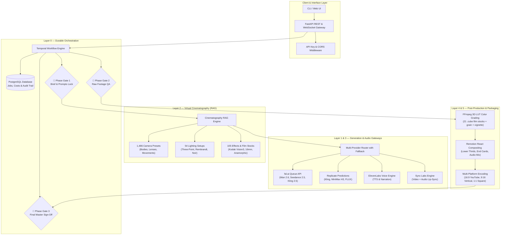

<h1 align="center">🎬 AI Studio</h1>

<p align="center">
  <strong>A Cloud-First, Production-Grade AI Video Automation System with Virtual Cinematography RAG, Multi-Provider Model Routing, and 26-Step SOP Governance.</strong>
</p>

<p align="center">
  <a href="https://buildwithdaksh.com"></a>
  <a href="https://github.com/Eaterofsouls/AI-Studio"></a>
  
  
  
  
  
  
</p>

<p align="center">
  <a href="#-executive-summary">Overview</a> &nbsp;&bull;&nbsp;
  <a href="#-why-this-exists">Why This Exists</a> &nbsp;&bull;&nbsp;
  <a href="#-architecture">Architecture</a> &nbsp;&bull;&nbsp;
  <a href="#-the-5-layer-production-engine">5-Layer Engine</a> &nbsp;&bull;&nbsp;
  <a href="#-the-26-step-production-sop--phase-gates">26-Step SOP</a> &nbsp;&bull;&nbsp;
  <a href="#-quick-start">Quick Start</a> &nbsp;&bull;&nbsp;
  <a href="#-rest-api--websocket-reference">API Reference</a> &nbsp;&bull;&nbsp;
  <a href="#-cost-economics">Cost Economics</a> &nbsp;&bull;&nbsp;
  <a href="#-author--credits">Author</a>
</p>

---

## 📌 Executive Summary

**AI Studio** is a self-hosted, cloud-first video automation platform designed to turn loose AI prompts into commercial-grade video deliverables. 

Instead of relying on rigid monthly subscriptions (like Higgsfield or Arcads at \$200–\$400/month) or fragile local GPU rigs that overheat and drop frames, this engine acts as an **intelligent orchestration layer**. It coordinates virtual cinematography databases, multi-provider cloud generation gateways, voice synthesis, lip-sync, React-based Remotion compositing, and mathematical 3D LUT film stock color grading into a unified, reliable pipeline.

Every single step is governed by a **26-Step Standard Operating Procedure (SOP)** with **three non-skippable Human-in-the-Loop (HITL) Phase Gates** enforced by **Temporal** durable execution.

---

## ⚡ Why This Exists: The 2026 AI Video Dilemma

| Feature | Walled-Garden Subscriptions<br>*(Higgsfield, Arcads)* | Fragile Local GPUs<br>*(Local ComfyUI / Wan)* | **AI Studio**<br>*(This Architecture)* |
| :--- | :--- | :--- | :--- |
| **Pricing Model** | \$200–\$400/month platform rent | High hardware & electricity costs | **Pay only for API seconds used (\$0.10–\$0.50/s)** |
| **Hardware Required** | Browser | High-end GPU (16GB–24GB+ VRAM) | **Zero local GPU required** (runs on modest VPS or laptop) |
| **Cinematography Control** | Generic UI sliders | Fragile node graphs | **1,645 RAG Presets** (ARRI, Cooke, Zeiss, Lighting, Stocks) |
| **Workflow Reliability** | Closed black box | Process crashes on out-of-memory | **Temporal Durable State Machine** (automatic retry & resumption) |
| **Audio & Lip-Sync** | Minimal or none | Complex multi-stage manual setup | **Integrated ElevenLabs TTS & Sync Labs Lip-Sync** |
| **Post-Production** | Download raw MP4 only | Manual video editing in Premiere | **Automated FFmpeg 21-LUT Grading + Remotion React Compositing** |
| **Commercial Packaging** | Single format | Manual re-encoding | **Auto-exports 16:9 (YouTube), 9:16 (Shorts/Reels), 1:1 (LinkedIn)** |
| :--- | :--- | :--- | :--- |
| **Pricing Model** | \$200–\$400/month platform rent | High hardware & electricity costs | **Pay only for API seconds used (\$0.10–\$0.50/s)** |
| **Hardware Required** | Browser | High-end GPU (16GB–24GB+ VRAM) | **Zero local GPU required** (runs on modest VPS or laptop) |
| **Cinematography Control** | Generic UI sliders | Fragile node graphs | **1,645 RAG Presets** (ARRI, Cooke, Zeiss, Lighting, Stocks) |
| **Workflow Reliability** | Closed black box | Process crashes on out-of-memory | **Temporal Durable State Machine** (automatic retry & resumption) |
| **Audio & Lip-Sync** | Minimal or none | Complex multi-stage manual setup | **Integrated ElevenLabs TTS & Sync Labs Lip-Sync** |
| **Post-Production** | Download raw MP4 only | Manual video editing in Premiere | **Automated FFmpeg 21-LUT Grading + Remotion React Compositing** |
| **Commercial Packaging** | Single format | Manual re-encoding | **Auto-exports 16:9 (YouTube), 9:16 (Shorts/Reels), 1:1 (LinkedIn)** |

---

## 🏛 System Architecture



---

## 🎬 The 5-Layer Production Engine

### Layer 0 — Durable Orchestration & State
* **FastAPI Backend**: Provides strictly typed, high-throughput asynchronous REST endpoints and real-time WebSockets.
* **Temporal Workflow Engine**: Coordinates multi-step production pipelines. If a third-party API times out or your server restarts mid-generation, Temporal automatically recovers state and retries with exponential backoff.
* **PostgreSQL Schema**: Records all jobs, production orders, itemized costs, and compliance audit trails down to the micro-dollar.

### Layer 1 — Multi-Provider Generation Gateway
* **Agnostic Routing**: Abstracts generation behind clean Python interfaces (`VideoProvider`, `ImageProvider`, `AudioProvider`, `LipSyncProvider`).
* **fal.ai Gateway**: Async non-blocking queue client for Wan 2.6, Seedance 2.5, Kling 2.5, and FLUX Schnell/Pro.
* **Replicate Gateway**: Automatic fallback provider supporting Kling, MiniMax H3, and open-weight diffusion models.
* **Cost Tracking**: Computes exact generation costs per second before and after generation.

### Layer 2 — Virtual Cinematography RAG (The Secret Sauce)
Instead of typing vague prompts like *"a cinematic shot of a car"*, the RAG layer queries 1,645 presets from vector storage or local lexical indexes to generate a mathematically precise directive:
> *"Shot on ARRI Alexa Mini LF with Cooke Anamorphic /i 35mm lens at f/1.4, slow tracking lateral movement, warm golden hour three-point lighting, Kodak Vision3 500T film stock emulation, subtle 35mm grain, anamorphic horizontal lens flare."*

* **1,486 Camera Presets**: Combinations of 8 cinema bodies (ARRI Alexa 35, RED V-Raptor, Sony VENICE 2, Panavision DXL2, Bolex 16mm), 11 lenses (Cooke S7/i, Atlas Orion, Helios 44-2, Laowa Probe), 6 focal lengths (8mm to 85mm), 3 apertures (f/1.4, f/4, f/11), and 20 camera movements (dolly in/out, crane up, orbit, steadicam, whip pan).
* **54 Lighting Setups**: Three-point daylight, Rembrandt, film noir venetian blinds, golden hour rim, neon cyberpunk, volumetric fog.
* **105 Effects Presets**: Kodak Vision3 500T/250D, CineStill 800T, Fuji Eterna, bleach bypass, Technicolor 2-strip, cross process.

### Layer 3 — Audio Synthesis & Lip-Sync
* **ElevenLabs Integration**: Synthesizes high-fidelity character dialogue and narration with emotion tuning and character-based billing ($0.05/1k chars on Turbo).
* **Sync Labs Lip-Sync**: Synchronizes video mouth and facial motion to the generated audio track, producing natural dialogue shots without uncanny AI morphing.

### Layer 4 — Post-Production & Color Finishing
* **FFmpeg 3D LUT Pipeline**: Applies mathematical color grading using 21 bundled `.cube` files (Kodak, Fuji, CineStill, Ilford B&W) paired with debanding (to eliminate AI compression artifacts), procedural 35mm film grain, and edge vignette.
* **Remotion React Compositing**: Assembles individual raw shots, audio beds, branded overlays, animated lower thirds, title graphics, and end cards using TypeScript and React components.

### Layer 5 — Multi-Platform Packaging & Distribution
* **Automated Aspect Ratio Variants**:
  * **YouTube Master (16:9)**: 1920x1080 / 4K, H.264 High Profile, 8 Mbps bitrate, AAC audio at -16 LUFS.
  * **Vertical Shorts / Reels / TikTok (9:16)**: 1080x1920 smart center crop with safe-zone protection.
  * **Square Feed (1:1)**: 1080x1080 optimized for LinkedIn and Instagram feed carousels.

---

## 🚦 The 26-Step Production SOP & Phase Gates

The studio engine enforces a rigorous 26-step workflow broken into three phases. **No phase proceeds without human sign-off at the gate.**

```
┌────────────────────────────────────────────────────────────────────────┐
│                        PHASE 1: PRE-PRODUCTION                        │
│  1. Brief Intake ──────► 4. Character Bible ─────► 7. RAG Cine Query   │
│  2. World Context        5. Worldbuilding           8. Audio Direction │
│  3. Beat Sheet           6. Shotlist & Storyboard   9. Look Tests      │
│                                                                        │
│  [🚦 PHASE GATE 1: Sign-off on Script, Shotlist, Prompts, Budget]       │
└───────────────────────────────────┬────────────────────────────────────┘
                                    │ Approved
┌───────────────────────────────────▼────────────────────────────────────┐
│                         PHASE 2: PRODUCTION                            │
│  14. Reference Frames ──► 15. Multi-Shot Video ──► 17. ElevenLabs VO   │
│                           16. Cine Relight/Deflick 18. Lip-Sync Sync   │
│                                                                        │
│  [🚦 PHASE GATE 2: Sign-off on Raw Rendered Footage & Audio QA]        │
└───────────────────────────────────┬────────────────────────────────────┘
                                    │ Approved
┌───────────────────────────────────▼────────────────────────────────────┐
│                       PHASE 3: POST-PRODUCTION                         │
│  20. Edit Assembly ────► 22. Upscaling ──────────► 24. Remotion Comp   │
│  21. 3D LUT Grading      23. -16 LUFS Audio Mix    25. Multi-Platform  │
│                                                                        │
│  [🚦 PHASE GATE 3: Final Client Approval & Automated Publishing]       │
└────────────────────────────────────────────────────────────────────────┘
```

---

## 🚀 Quick Start

### Option A: Local Setup (Recommended for Development)

#### 1. Clone & Setup Environment
```bash
git clone https://github.com/Eaterofsouls/AI-Studio.git
cd AI-Studio

# Create virtual environment (Python 3.10+)
python -m venv .venv
source .venv/bin/activate  # Windows: .venv\Scripts\activate

# Install dependencies
pip install -r requirements.txt
```

#### 2. Configure Credentials
```bash
cp .env.example .env
```
Edit `.env` and fill in your keys (only `FAL_KEY` is required for video generation):
```env
FAL_KEY=your_fal_api_key
ELEVENLABS_API_KEY=your_elevenlabs_key
SYNCLABS_API_KEY=your_synclabs_key
OPENAI_API_KEY=your_openai_key
DATABASE_URL=sqlite+aiosqlite:///./cinema_studio.db
```

#### 3. Start the API Server
```bash
uvicorn cinema_engine.api.main:app --host 0.0.0.0 --port 8000 --reload
```
Interactive Swagger API documentation is now live at: **`http://localhost:8000/docs`**

---

### Option B: Docker Compose (Full Production Stack)

Spin up the entire architecture—FastAPI, Temporal Server, Temporal Web UI, PostgreSQL 16, and Qdrant—in one command:
```bash
docker compose up -d
```
* **FastAPI Service**: `http://localhost:8000`
* **Temporal Web UI**: `http://localhost:8233`
* **PostgreSQL Database**: `localhost:5432`
* **Qdrant Vector DB**: `http://localhost:6333`

---

## 📡 REST API & WebSocket Reference

### 1. Direct Video Generation with Auto-Grading
```bash
curl -X POST http://localhost:8000/api/v1/generate \
  -H "Content-Type: application/json" \
  -d '{
    "prompt": "Cinematic close up of an astronaut on Mars looking into a glowing dust storm",
    "model": "wan-2.6",
    "duration_sec": 5,
    "aspect_ratio": "16:9",
    "auto_grade": true
  }'
```

### 2. RAG Virtual Cinematography Generation
Assembles camera, lighting, and film stock directives automatically:
```bash
curl -X POST http://localhost:8000/api/v1/generate/cinematic \
  -H "Content-Type: application/json" \
  -d '{
    "shot_description": "Detective examining a cracked vault in a shadowy office",
    "camera_query": "slow dolly in 50mm shallow depth of field anamorphic",
    "lighting_query": "film noir venetian blind high contrast shadows",
    "effects_query": "kodak vision3 500t organic film grain",
    "model": "wan-2.6",
    "duration_sec": 5
  }'
```

### 3. ElevenLabs Voiceover Generation
```bash
curl -X POST http://localhost:8000/api/v1/audio/speech \
  -H "Content-Type: application/json" \
  -d '{
    "text": "In a world governed by algorithms, one studio chose to build for human vision.",
    "model_id": "eleven_turbo_v2_5"
  }'
```

### 4. Sync Labs Lip Synchronization
```bash
curl -X POST http://localhost:8000/api/v1/lipsync \
  -H "Content-Type: application/json" \
  -d '{
    "video_url_or_path": "storage/raw/shot_01.mp4",
    "audio_url_or_path": "storage/audio/narration_01.mp3",
    "model": "lipsync-2"
  }'
```

### 5. Human-in-the-Loop Phase Gate Sign-Offs
```bash
# Approve Gate 1: Pre-Production Locked (Script, Shotlist, Prompts)
curl -X POST http://localhost:8000/api/v1/projects/proj_abc123/approve-gate/1

# Approve Gate 2: Production Locked (Raw Footage & Audio QA)
curl -X POST http://localhost:8000/api/v1/projects/proj_abc123/approve-gate/2

# Approve Gate 3: Final Master Approved for Distribution
curl -X POST http://localhost:8000/api/v1/projects/proj_abc123/approve-gate/3
```

### 6. Live Cost Governance & Audit
```bash
curl -X GET http://localhost:8000/api/v1/costs
```
**Response**:
```json
{
  "total_cost_usd": "4.1500",
  "total_transactions": 8,
  "by_service": {
    "fal_wan-2.6": "3.0000",
    "elevenlabs_speech": "0.1500",
    "synclabs_lipsync": "1.0000"
  },
  "by_model": {}
}
```

---

## 💰 Cost Economics: Real-World Case Studies

### Case Study A: 30-Second Commercial
* 6 shots &times; 5s video via fal.ai Wan 2.6: **\$3.00**
* 30-second voiceover via ElevenLabs: **\$0.15**
* 2 talking head lip-sync sequences via Sync Labs: **\$1.00**
* Local FFmpeg 3D LUT grading: **\$0.00**
* Local Remotion compositing: **\$0.00**
* 3-platform packaging (16:9, 9:16, 1:1): **\$0.00**
* **Total Cost: ~\$4.15 per delivered commercial film**
* *(vs. \$200/mo subscription platforms = 97% savings)*

### Case Study B: 60-Second Documentary
* 12 shots &times; 5s video via mixed models: **\$6.00**
* 60s narrator voiceover via ElevenLabs: **\$0.30**
* Background atmospheric sound design: **\$0.20**
* Color grading & 4K upscaling: **\$0.50**
* **Total Cost: ~\$7.00 per finished 1-minute narrative video**

---

## 🧪 Testing & Verification

The repository includes a comprehensive 21-test suite with 100% pass rate:
```bash
pytest tests/ -v
```

```text
tests/test_phase1.py::test_settings_initialization PASSED                [  4%]
tests/test_phase1.py::test_generation_models_validation PASSED           [  9%]
tests/test_phase1.py::test_provider_registry_and_cost_estimation PASSED  [ 14%]
tests/test_phase1.py::test_color_grade_lut_resolution PASSED             [ 19%]
tests/test_phase1.py::test_ffmpeg_discovery PASSED                       [ 23%]
tests/test_phase1.py::test_database_initialization_and_operations PASSED [ 28%]
tests/test_phase1.py::test_fastapi_endpoints PASSED                      [ 33%]
tests/test_phase2.py::test_rag_presets_loading PASSED                    [ 38%]
tests/test_phase2.py::test_rag_local_search PASSED                       [ 42%]
tests/test_phase2.py::test_rag_directive_assembly PASSED                 [ 47%]
tests/test_phase2.py::test_replicate_provider_cost_estimation PASSED     [ 52%]
tests/test_phase2.py::test_elevenlabs_provider_cost_estimation PASSED    [ 57%]
tests/test_phase2.py::test_synclabs_provider_cost_estimation PASSED      [ 61%]
tests/test_phase2.py::test_provider_registry_multi_provider_routing PASSED [ 66%]
tests/test_phase2.py::test_fastapi_phase2_endpoints PASSED               [ 71%]
tests/test_phase3.py::test_platform_specs_validation PASSED              [ 76%]
tests/test_phase3.py::test_remotion_fallback_render PASSED               [ 80%]
tests/test_phase3.py::test_platform_variant_encoding PASSED              [ 85%]
tests/test_phase3.py::test_production_activities PASSED                  [ 90%]
tests/test_phase3.py::test_production_workflow_gates_and_state PASSED    [ 95%]
tests/test_phase3.py::test_fastapi_phase3_project_and_gate_endpoints PASSED [100%]

============================= 21 passed in 21.34s =============================
```

---

## 📁 Repository Structure

```
AI-Studio/
├── cinema_engine/                 # Core Python engine package
│   ├── config.py                  # Pydantic settings & storage management
│   ├── models.py                  # Domain schemas & API request models
│   ├── db.py                      # SQLAlchemy 2.0 async ORM & SQLite/Postgres
│   ├── api/                       # FastAPI service & WebSocket manager
│   │   └── main.py
│   ├── providers/                 # Multi-provider async adapters
│   │   ├── base.py                # Abstract provider interfaces
│   │   ├── fal_provider.py        # fal.ai queue adapter (Wan, Seedance, Kling)
│   │   ├── replicate_provider.py  # Replicate predictions adapter
│   │   ├── elevenlabs_provider.py # ElevenLabs TTS & narration
│   │   ├── synclabs_provider.py   # Sync Labs lip-sync
│   │   └── registry.py            # Dynamic routing with priority fallbacks
│   ├── rag/                       # Virtual cinematography RAG
│   │   ├── presets.py             # 1,645 Presets loader & lexical matcher
│   │   └── query.py               # Dual-mode RAG query service
│   ├── post/                      # Post-production finishing
│   │   ├── grading.py             # FFmpeg 3D LUT color grading
│   │   ├── remotion_render.py     # Remotion React compositing
│   │   └── encode.py              # Platform packaging (16:9, 9:16, 1:1)
│   └── workflows/                 # Temporal durable orchestration
│       ├── production.py          # 26-Step Production SOP & Phase Gates
│       ├── activities.py          # Discrete retriable activities
│       └── worker.py              # Temporal worker daemon
├── luts/                          # 21 Production .cube LUT files
│   ├── base/                      # Neutral normalize
│   ├── film_stocks/               # Kodak Vision3, CineStill, Fuji, Ilford
│   └── creative/                  # Bleach bypass, Technicolor, Teal & Orange
├── remotion/                      # Remotion React video compositions
├── tools/                         # Presets JSON data (Camera, Light, FX)
├── tests/                         # Automated test suite (21 tests)
├── .github/workflows/ci.yml       # GitHub Actions CI pipeline
├── docker-compose.yml             # Full-stack container orchestration
├── Dockerfile                     # Production image build
├── AUTHOR.md                      # System architecture & author details
└── README.md                      # Extensive project guide
```

---

## 👨‍💻 Author & Credits

**AI Studio** was designed and engineered by:

**Daksh Chauhan**  
*Full-Stack Systems Architect & AI Automation Engineer*

* 🌐 **Portfolio & Case Studies**: [buildwithdaksh.com](https://buildwithdaksh.com)
* 🐙 **GitHub**: [@Eaterofsouls](https://github.com/Eaterofsouls)
* 💼 **LinkedIn**: [linkedin.com/in/daksh-r-chauhan](https://linkedin.com/in/daksh-r-chauhan)
* ✉️ **Contact**: [me@buildwithdaksh.com](mailto:me@buildwithdaksh.com)

Read [`AUTHOR.md`](AUTHOR.md) for the complete engineering philosophy and design story.

---

## 📜 License
Released under the [MIT License](LICENSE). &copy; 2026 Daksh Chauhan.
